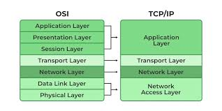

### Table of Contents all at once

- [OSI vs TCP/IP Models](#osi-vs-tcpip-models--networking-notes)
- [7 Layers of OSI Model](#7-layers-of-osi-model)
- [TCP/IP model](#tcpip-model)
- [TCP vs UDP in Transport layer](#tcp-vs-udp-in-transport-layer)
- [Making TCP and UDP Connection](#making-tcp-and-udp-connection)
- [IP Addressing](#ip-addressing)
- [Static vs Dynamic IP Addresses](#static-vs-dynamic-ip-addresses)
- [What is a Port?](#what-is-a-port)
- [DNS (Domain Name System)](#dns-domain-name-system)
- [NAT & Firewall](#nat--firewall)
- [MAC Address](#mac-address)
- [NIC (Network Interface Card) / Ethernet Card](#nic-network-interface-card--ethernet-card)
- [Subnetting & Load Balancer](#subnetting--load-balancer)
- [VPN (Virtual Private Network)](#vpn-virtual-private-network)
- [Container vs VM Networking Comparison](#container-vs-vm-networking-comparison)
- [Ethernet](#ethernet)

# OSI vs TCP/IP Models – Networking Notes

## OSI Model (Open Systems Interconnection)

The OSI model is a **theoretical reference model** that standardizes network functions into **7 layers**. Each layer has a specific role in the communication process.

## Who created OSI ?
- Full form: **Open Systems Interconnection**  
- **Created by:** ISO (International Organization for Standardization) in 1984  
- **Purpose:** Standardize networking concepts; theoretical model, **not a protocol**  
- **Usage:** Learning, troubleshooting, vendor-neutral framework

# 7 Layers of OSI Model

## 1. Physical Layer
- Transmits raw bits (0s and 1s) over physical media  
- Media: Cables, switches, Wi-Fi signals  
- **Example:** Ethernet cables, Wi-Fi signals  

## 2. Data Link Layer
- Creates frames and handles MAC addresses  
- Performs error detection (CRC)  
- **Example:** Switch, Ethernet, ARP  

## 3. Network Layer
- Creates packets and handles IP addressing & routing  
- **Example:** Routers, IP, ICMP (ping)  

## 4. Transport Layer
- Provides end-to-end communication  
- Ensures reliability (TCP) or fast delivery (UDP)  
- **Example:** TCP, UDP, Port numbers  

## 5. Session Layer
- Establishes, maintains, and terminates sessions  
- **Example:** NetBIOS, RPC  

## 6. Presentation Layer
- Translates, encrypts, and compresses data  
- **Example:** SSL/TLS encryption, JPEG, GIF formats  

## 7. Application Layer
- Closest to the user; where applications interact with the network  
- **Example:** HTTP, HTTPS, FTP, SMTP, DNS


### 7 Layers of OSI

| Layer No. | Layer Name        | Function                                         | Examples                   |
|-----------|-----------------|-------------------------------------------------|---------------------------|
| 7         | **Application**  | Provides network services to applications      | HTTP, HTTPS, FTP, SMTP, DNS |
| 6         | **Presentation** | Data translation, encryption, compression       | SSL/TLS, JPEG, GIF        |
| 5         | **Session**      | Establishes, manages, and terminates sessions  | NetBIOS, RPC              |
| 4         | **Transport**    | End-to-end communication, reliability           | TCP, UDP, Port numbers    |
| 3         | **Network**      | Routing, logical addressing                     | IP, ICMP, Routers         |
| 2         | **Data Link**    | Frames, MAC addresses, error detection          | Ethernet, Switch, ARP     |
| 1         | **Physical**     | Transmission of raw bits over physical medium  | Cables, Wi-Fi signals     |

---
# TCP/IP model

## Who created TCP/IP Model ?

- Full form: **Transmission Control Protocol / Internet Protocol**  
- **Created by:** ARPANET researchers (1970s-1980s), key people: Vinton Cerf & Robert Kahn  
- **Governed by:** IETF (Internet Engineering Task Force)  
- **Purpose:** Real-world networking, Internet communication  
- **Includes:** TCP, IP, UDP, HTTP, DNS, etc.

# 4 Layers of TCP/IP Model

## 1. Network Access / Link Layer
- Combines Physical + Data Link layers of OSI  
- Handles physical transmission and framing  
- **Example:** Ethernet, Wi-Fi, ARP  

## 2. Internet Layer
- Maps to OSI Network layer  
- Handles IP addressing and routing  
- **Example:** IP, ICMP (ping)  

## 3. Transport Layer
- Maps to OSI Transport layer  
- Provides end-to-end communication  
- Handles TCP/UDP and port numbers  
- **Example:** TCP, UDP  

## 4. Application Layer
- Combines OSI Session, Presentation, and Application layers  
- Provides network services to applications  
- **Example:** HTTP, HTTPS, FTP, DNS, SMTP  

---

| Layer Name       | Function                                   | OSI Layer Mapping        | Examples               |
|-----------------|-------------------------------------------|-------------------------|-----------------------|
| **Application**  | Handles application, presentation, session | OSI 5,6,7               | HTTP, HTTPS, FTP, DNS |
| **Transport**    | Provides end-to-end communication         | OSI 4                   | TCP, UDP, Ports       |
| **Internet**     | Logical addressing, routing               | OSI 3                   | IP, ICMP              |
| **Network Access / Link** | Physical transmission, framing     | OSI 1,2                 | Ethernet, Wi-Fi       |

---

- IP = “Where to send” → finds the path to destination.
- TCP = “How to send reliably” → ensures data arrives intact and in order.
- Together (TCP/IP) → Internet works: IP routes packets, TCP makes sure they’re received correctly.

# 🔹 OSI vs TCP/IP Comparison

| Feature       | OSI Model (7 Layers)               | TCP/IP Model (4 Layers)             |
|---------------|-----------------------------------|------------------------------------|
| Model Type    | Theoretical / Reference Model      | Practical / Implementation Model    |
| Layers        | 7 (Physical → Application)         | 4 (Link → Application)             |
| Usage         | Study, teaching, conceptual framework | Real-world networking & Internet |
| Examples      | Switch = Layer 2, Router = Layer 3 | Internet works fully on TCP/IP     |

---


# Summary
- **OSI:** Theory model with 7 layers for detailed understanding  
- **TCP/IP:** Practical model with 4 layers used on the Internet  
- Both models map to each other; TCP/IP is what the Internet uses  
- Understanding OSI helps in troubleshooting and learning networking concept

# TCP vs UDP in Transport layer

## Introduction
- **TCP (Transmission Control Protocol)** → Reliable, connection-oriented protocol.  
- **UDP (User Datagram Protocol)** → Fast, connectionless protocol.  

---

## TCP Header Structure
- Source Port
- Destination Port
- Sequence Number
- Acknowledgment Number
- Flags (SYN, ACK, FIN, RST, PSH, URG)
- Window Size
- Checksum
- Urgent Pointer

---

## TCP Flags Explained
| Flag  | Meaning | Example |
|-------|----------|---------|
| SYN   | Start connection (synchronize) | "Hello, let's talk" |
| ACK   | Acknowledge received data | "Got it ✅" |
| FIN   | Finish connection | "Bye 👋" |
| RST   | Reset connection | "Error ❌, start over" |
| PSH   | Push data immediately | "Send quickly ⚡" |
| URG   | Urgent data | "Emergency 🚨" |

👉 TCP = Full rishta system (proposal → confirm → bye).

---

## UDP Header Structure
- Source Port
- Destination Port
- Length
- Checksum

---

## Why No Flags in UDP?
- No handshake  
- No connection management  
- No sequencing  
- Just **fast delivery** → "fire and forget" model  

👉 UDP = "Arre sunoo!" → Bhej diya, ab suno ya ignore karo, koi farq nahi.

---

## TCP vs UDP Comparison

| Feature            | TCP                         | UDP                       |
|--------------------|-----------------------------|---------------------------|
| Connection setup   | SYN/ACK handshake           | No handshake              |
| Reliability        | ACK, Retransmission         | Best effort (no ACK)      |
| Order              | Sequence numbers            | No order                  |
| Flags              | SYN, ACK, FIN, RST, PSH…    | ❌ No flags               |
| Speed              | Slower (heavy header)       | Faster (light header)     |
| Use Cases          | Web (HTTP/HTTPS), Email     | Video/Voice streaming, Gaming |

---

# Making tcp and udp connection

## Tools Used
- **Netcat (nc / ncat)** → Send & receive TCP/UDP packets

## 1. TCP Server–Client Test

### Server

```bash
nc -l -p 8080
```

1. -l → Listen mode.
2. -p 8080 → Port number 8080 pe wait karega.
3. Your terminal should stucked
4. Open new terminal and use below command

### Client

```bash
nc 127.0.0.1 8080
```

5. 127.0.0.1 → Localhost (same machine).
6. Will establish connection in 8080.
7. Background TCP 3-way handshake (SYN → SYN-ACK → ACK).
8. Now if you type in server or client any thing it will show at both point.
9. For UDP connection just use -u also and same command.

## Real-World Examples
- **TCP**:  
  - HTTP (websites)  
  - HTTPS (secure websites)  
  - SMTP/IMAP (emails)  
  - FTP (file transfer)  

- **UDP**:  
  - DNS (Domain name queries)  
  - VoIP (Skype, Zoom calls)  
  - Online Gaming (PUBG, COD)  
  - Streaming (YouTube Live, Twitch)

---

# IP Addressing

## What is an IP Address?
- **IP Address (Internet Protocol Address):** A unique identifier assigned to devices in a network for communication.  
- Allows devices to **send and receive data** over networks like LAN or the Internet.  
- Types: **IPv4** and **IPv6**

---

## IPv4 (Internet Protocol version 4)
- **Format:** 32-bit address, usually written in **dotted decimal** (e.g., `192.168.1.10`)  
- **Range:** 0.0.0.0 to 255.255.255.255  
- **Number of addresses:** ~4.3 billion  
- **Classes:** A, B, C, D, E (for networks, multicast, experimental)
- **Address classes:**
- - Class A: 1.0.0.0 – 126.255.255.255 (Large networks)
- - Class B: 128.0.0.0 – 191.255.255.255 (Medium networks)
- - Class C: 192.0.0.0 – 223.255.255.255 (Small networks)
- - Class D: 224.0.0.0 – 239.255.255.255 (Multicast)
- - Class E: 240.0.0.0 – 255.255.255.255 (Experimental)
- **Example:** `192.168.1.1` (common home router IP)  
- **Pros:** Widely supported, simple  
- **Cons:** Limited address space  

---

## IPv6 (Internet Protocol version 6)
- **Format:** 128-bit address, written in **hexadecimal colon notation** (e.g., `2001:0db8:85a3:0000:0000:8a2e:0370:7334`)  
- **Number of addresses:** ~340 undecillion (practically unlimited)  
- **Features:**  
  - Larger address space  
  - Built-in security (IPSec)  
  - No need for NAT  
  - Auto-configuration (stateless address autoconfiguration)  
- **Example:** `fe80::1ff:fe23:4567:890a`  
- **Pros:** Solves IPv4 exhaustion, better routing, security  
- **Cons:** Not universally adopted yet, complex notation  

---

## Public vs Private IP Address

| Type      | Definition | Range (IPv4) | Example | Usage |
|-----------|-----------|--------------|---------|-------|
| Public IP | Globally unique, routable over Internet | Varies | `142.250.72.14` (Google) | Access from Internet |
| Private IP | Local network only, not routable on Internet | `10.0.0.0/8`, `172.16.0.0/12`, `192.168.0.0/16` | `192.168.1.10` | Internal LAN, home/small office |

- **NAT (Network Address Translation)** allows private IPs to communicate over the Internet via a public IP.

---

## Localhost / Loopback Address
- **Definition:** IP that points back to the same device  
- **IPv4:** `127.0.0.1`  
- **IPv6:** `::1`  
- **Usage:**  
  - Testing local services (web servers, APIs)  
  - Debugging without external network  

---

## Key Differences Between IPv4 and IPv6

| Feature       | IPv4                     | IPv6                          |
|---------------|-------------------------|-------------------------------|
| Address Size  | 32-bit                  | 128-bit                       |
| Notation      | Dotted decimal          | Hexadecimal colon-separated  |
| Address Space | ~4.3 billion            | Practically unlimited         |
| NAT           | Often required          | Not required                  |
| Security      | Optional (IPSec)        | Built-in (IPSec mandatory)    |
| Header        | Simple                  | More complex                  |
| Deployment    | Worldwide, legacy       | Growing adoption              |

---

## Quick Commands (Linux / Windows)
- **Check IP Address:**  
  ```bash
  ip addr        # Linux
  ifconfig       # Linux (legacy)
  ipconfig       # Windows
  
# Static vs Dynamic IP Addresses

## Static IP
- **Definition:** An IP address that is **manually assigned** to a device and does **not change** over time.  
- **Assignment:** Configured manually by network administrator or in device settings.  
- **Usage Examples:**  
  - Servers (web, email, database)  
  - Network printers  
  - Routers and firewalls  
- **Advantages:**  
  - Predictable and consistent  
  - Easier to manage DNS and remote access  
- **Disadvantages:**  
  - Manual setup required  
  - Harder to scale in large networks  

---

## Dynamic IP
- **Definition:** An IP address that is **automatically assigned** by a DHCP server and **can change** over time.  
- **Assignment:** Handled automatically using **DHCP (Dynamic Host Configuration Protocol)**  
- **Usage Examples:**  
  - Home computers and smartphones  
  - Office networks for general devices  
- **Advantages:**  
  - Easy to manage  
  - Efficient use of IP addresses (reuse)  
- **Disadvantages:**  
  - IP may change, difficult for hosting servers  
  - Remote access may require extra setup  

---

## What is a Port?
- A **port** is a logical endpoint for communication on a device.  
- Every IP address can have **65,536 ports** (0-65535).  
- Helps **distinguish services** running on the same device.  
- Example: Web server runs on port `80`, SSH on `22`.

---

## Types of Ports

### 1. Well-Known Ports
- Range: 0 – 1023  
- Used by **common services and protocols**  
- Example:
  | Protocol | Port | Usage           |
  |----------|------|----------------|
  | HTTP     | 80   | Web traffic    |
  | HTTPS    | 443  | Secure web     |
  | SSH      | 22   | Secure login   |
  | FTP      | 21   | File transfer  |
  | DNS      | 53   | Domain lookup  |

### 2. Registered Ports
- Range: 1024 – 49151  
- Assigned to specific applications or vendors  
- Example: MySQL `3306`, PostgreSQL `5432`

### 3. Dynamic / Private Ports
- Range: 49152 – 65535  
- Used for **temporary connections**, often assigned by OS

---

## TCP vs UDP Ports
| Feature        | TCP                           | UDP                        |
|----------------|-------------------------------|----------------------------|
| Connection     | Connection-oriented           | Connectionless            |
| Reliability    | Reliable (ack, retransmit)   | Unreliable (faster)       |
| Use Case       | HTTP, HTTPS, FTP, SSH        | DNS, VoIP, streaming      |
| Port Example   | TCP 80 (HTTP)                | UDP 53 (DNS)              |

---

## Common Networking Ports

| Protocol  | Port | TCP/UDP | Usage                   |
|-----------|------|---------|-------------------------|
| HTTP      | 80   | TCP     | Web traffic             |
| HTTPS     | 443  | TCP     | Secure web              |
| SSH       | 22   | TCP     | Secure shell login      |
| FTP       | 21   | TCP     | File transfer           |
| SFTP      | 22   | TCP     | Secure file transfer    |
| SMTP      | 25   | TCP     | Email sending           |
| POP3      | 110  | TCP     | Email receiving         |
| IMAP      | 143  | TCP     | Email retrieval         |
| DNS       | 53   | UDP/TCP | Domain resolution       |
| DHCP      | 67/68| UDP     | IP assignment           |
| MySQL     | 3306 | TCP     | Database server         |
| PostgreSQL| 5432 | TCP     | Database server         |
| RDP       | 3389 | TCP     | Remote Desktop Protocol |

---

# DNS (Domain Name System)

## What is DNS?
- DNS = **Domain Name System**  
- It translates **human-readable names** (`google.com`) into **IP addresses** (`142.250.183.238`).  
- Often called the "phonebook of the internet."

---

## How DNS Works
1. User enters `example.com` in a browser.
2. Query goes to a **DNS Resolver** (e.g., ISP DNS or Google 8.8.8.8).
3. Resolver asks the **Root Server** → "Where is `.com`?"
4. Root Server replies: "Ask the `.com` TLD server."
5. Resolver asks the **TLD Server** → "Where is `example.com`?"
6. TLD replies: "Ask the Authoritative Server."
7. Authoritative Server returns the IP address: `203.0.113.10`.
8. Resolver gives the IP to the browser → connection established.

---

## Important Components
- **Resolver**: Middleman that queries on your behalf.  
- **Root DNS Servers**: Top of the hierarchy (13 identities: A–M).  
- **TLD Servers**: Handle `.com`, `.org`, `.in`, etc.  
- **Authoritative DNS Servers**: Store the actual records for your domain.  

---

## DNS Records
| Record | Purpose | Example |
|--------|---------|---------|
| **A** | IPv4 Address | `example.com → 203.0.113.10` |
| **AAAA** | IPv6 Address | `example.com → 2001:db8::1` |
| **CNAME** | Alias/Redirect | `blog.example.com → example.com` |
| **MX** | Mail Server | `example.com → mail.example.com` |
| **NS** | Nameserver | `ns1.example.com` |
| **TXT** | Extra info (SPF, DKIM) | `"v=spf1 include:_spf.google.com"` |
| **PTR** | Reverse lookup | `203.0.113.10 → example.com` |

---

## Caching and TTL
- **TTL (Time To Live)**: Defines how long a record stays in cache.  
- DNS results are cached at:
  1. Browser level
  2. Operating System
  3. Resolver/ISP

Example: If TTL = 300 seconds, resolvers will refresh every 5 minutes.

---

## Queries: Recursive vs Iterative
- **Recursive Query**: Resolver does all the work and returns the final answer.  
- **Iterative Query**: Server gives a referral, user must ask the next server.

---

## DNS Propagation
- When you update a DNS record (e.g., point domain to a new IP), it takes **24–48 hours** to update worldwide.  
- Reason: Different caches (resolvers, browsers, OS) expire at different times.  

---

## Root Servers & Management
- **13 Root Identities (A–M)** but **1000+ physical servers** worldwide (using Anycast).  
- Managed by organizations like **ICANN, Verisign, NASA, RIPE NCC, ISC** etc.  
- **ICANN/IANA** oversees the DNS root zone.  
- **Registries** manage TLDs (.com, .in).  
- **Registrars** (GoDaddy, Namecheap) sell domains.  
- **Authoritative DNS providers** (Cloudflare, AWS Route 53) hold final records.

---

## Hosts File vs DNS
- **Hosts file** = Local manual mapping (`/etc/hosts` or `C:\Windows\System32\drivers\etc\hosts`).  
- Checked **before DNS resolution**.  
- Automatic updates do **not** happen here.  
- DNS updates only propagate through authoritative servers + resolvers.

---

## Security (DNSSEC)
- **DNSSEC = DNS Security Extensions**  
- Adds digital signatures to DNS data.  
- Prevents attacks like **cache poisoning** or fake records.  

---

# NAT & Firewall

## Introduction
NAT and Firewalls are two core technologies in networking.  
- **NAT** solves the IPv4 shortage problem and hides private networks behind a single public IP.  
- **Firewalls** secure your network by filtering traffic based on rules.

---

# NAT

### Why NAT exists
- IPv4 addresses are limited.  
- NAT allows private IPs (e.g., `192.168.x.x`) to communicate with the public internet.  
- Provides **security** and **flexibility**.

---

### Types of NAT
1. **Static NAT**  
   - One private IP ↔ One public IP (1:1 mapping).  
   - Example: `192.168.1.10 ↔ 203.0.113.5`.

2. **Dynamic NAT**  
   - Maps private IPs to a pool of public IPs.  
   - Not always predictable which public IP will be assigned.

3. **PAT (Port Address Translation / NAT Overload)**  
   - Many private IPs share **one public IP** but with **different source ports**.  
   - Most common type of NAT in home and office networks.

---

### How PAT (Port Address Translation) works
Imagine two private devices:  
- PC1 → `192.168.1.2:5001`  
- PC2 → `192.168.1.3:5001`  

Both want to connect to `google.com:80`.  

NAT router changes it like this:  
- `192.168.1.2:5001 → 203.0.113.5:40001`  
- `192.168.1.3:5001 → 203.0.113.5:40002`  

When replies come back:  
- `203.0.113.5:40001 → 192.168.1.2:5001`  
- `203.0.113.5:40002 → 192.168.1.3:5001`  

✔ This way multiple private devices share the same public IP.

---

### NAT Table Example
| Private IP:Port     | Public IP:Port    | Destination         |
|----------------------|-------------------|---------------------|
| 192.168.1.2:5001    | 203.0.113.5:40001 | google.com:80       |
| 192.168.1.3:5001    | 203.0.113.5:40002 | google.com:80       |

---

# Firewall

### What is a Firewall?
A **firewall** is a security system that monitors and controls traffic based on **rules**.  
It acts like a security guard at the gate.

---

### Types of Firewalls
1. **Packet-filtering firewall**  
   - Checks source IP, destination IP, port.  

2. **Stateful firewall**  
   - Tracks connection states (e.g., established or new).  

3. **Application firewall**  
   - Filters at application level (HTTP, FTP, etc.).  

4. **Next-Gen Firewall (NGFW)**  
   - Combines packet + stateful + deep inspection.  

---

### How Firewalls Work
- Rules are defined like:  
  - Allow: `TCP 80 (HTTP)`  
  - Deny: `TCP 23 (Telnet)`  
- Incoming/outgoing traffic must pass through firewall checks.  
- Can be **host-based** (on a server/PC) or **network-based** (on a router/firewall appliance).

---

# NAT vs Firewall
| Feature         | NAT                                   | Firewall                                |
|-----------------|---------------------------------------|-----------------------------------------|
| Purpose         | Translate IPs (private ↔ public)     | Allow/Block traffic                     |
| Security        | Provides basic hiding                | Strong security enforcement             |
| Common in       | Routers, ISPs, Cloud Gateways        | Routers, Firewalls, Servers             |

---

# MAC Address

## Introduction
A **MAC (Media Access Control) address** is a unique identifier assigned to every network interface card (NIC).  
It works at the **Data Link Layer (Layer 2)** of the OSI model and is essential for local network communication.

---

## What is a MAC Address?
- A **48-bit number** (6 bytes) usually written in hexadecimal:
  - Example: `00:1A:2B:3C:4D:5E`
- Burned into the NIC during manufacturing.
- Often called a **hardware address** or **physical address**.

---

## Why is MAC needed?
- **Device identification inside a LAN** → Switches use MAC to forward frames.
- **Delivery guarantee** → IP addresses are logical; actual delivery on LAN requires MAC.
- **Tracking & security** → Access control lists, filtering, and device monitoring use MAC.
- **Virtualization** → Each VM/container needs a unique MAC for networking.

---

## Format of MAC Address
- 6 groups of 2 hex digits (total 48 bits).
- Example: `AA:BB:CC:DD:EE:FF`
- First 24 bits = **OUI (Organizationally Unique Identifier)** → identifies manufacturer.
- Last 24 bits = device-specific.

---

## How MAC is used in networking

### LAN communication
- Devices talk via IP, but final delivery in LAN happens using MAC.
- Example:
  - PC1 → `192.168.1.10 (AA:BB:CC:11:22:33)`
  - PC2 → `192.168.1.20 (DD:EE:FF:44:55:66)`
  - PC1 sends ping to PC2 → ARP finds PC2’s MAC → Frame delivered to `DD:EE:FF:44:55:66`.

### Switches and MAC tables
- Switch learns which MAC is on which port (MAC address table).
- Uses this to forward traffic only to correct port (not broadcast).

### Wi-Fi and wireless networks
- Access Points (APs) identify devices by MAC.
- Wi-Fi authentication and filtering can be based on MAC.

### ISP authentication and MAC filtering
- Some ISPs bind service to customer’s router MAC.
- Routers/Access Points can block/allow devices by MAC.

### Tracking and monitoring
- Airports/malls track customers’ phones via MAC when Wi-Fi is on.
- Each beacon frame your phone sends includes MAC.

### Virtualization and cloud
- VMs and containers get unique virtual MACs.
- AWS, Azure, GCP assign MAC addresses to network interfaces.

---

## Relation between MAC and IP (ARP)
- **IP = Logical address (Layer 3)**  
- **MAC = Physical address (Layer 2)**  
- Mapping happens using **ARP (Address Resolution Protocol)**:
  - “Who has IP 192.168.1.20? Tell 192.168.1.10.”
  - Response: “192.168.1.20 is at MAC DD:EE:FF:44:55:66.”

---

## Is MAC limited like IP?
- **IPv4 is limited** (32-bit → ~4.3 billion addresses).  
- **MAC is larger** (48-bit → ~281 trillion possible addresses).  
- Practically, manufacturers won’t run out soon.  
- Newer standards (EUI-64) extend MAC to 64 bits if ever required.  
- So **MAC exhaustion is not a concern**, unlike IPv4.

---

## MAC Spoofing
- Although factory-assigned, MAC can be changed at OS/driver level.
- **Why spoof?**
  - Privacy & anonymity on public Wi-Fi.
  - Bypass MAC filtering.
  - Security testing.
- **Example (Linux):**
  ```bash
  ifconfig eth0 down
  ifconfig eth0 hw ether 00:11:22:33:44:55
  ifconfig eth0 up
  ```

# NIC (Network Interface Card) / Ethernet Card

## Introduction
- **NIC (Network Interface Card)** is a hardware component that connects your computer or server to a network.  
- It can be **wired** (Ethernet card) or **wireless** (Wi-Fi card).  
- Each NIC has a **unique MAC address** to identify it in the network.

---

## What is NIC / Ethernet Card?
- NIC = Network Interface Card  
- Ethernet Card = Wired NIC (uses RJ45 port)  
- Provides **physical connection** between device and network.  
- Works at **Layer 2 (Data Link Layer)** of OSI model.

---

## Functions of NIC
1. **Data Link Layer communication**: Handles sending and receiving frames.  
2. **Digital ↔ Electrical / Wireless conversion**: Converts computer data into signals for network.  
3. **Communication management**:
   - Receive packets from network → deliver to OS.  
   - Send packets from OS → transmit to network.  
4. **Duplex modes**:
   - Half duplex: send or receive at a time  
   - Full duplex: send & receive simultaneously  

---

## Types of NIC

| Type          | Description                          | Example                     |
|---------------|--------------------------------------|-----------------------------|
| Wired NIC     | Ethernet card with RJ45 port         | Intel Gigabit NIC           |
| Wireless NIC  | Wi-Fi card                           | TP-Link Wi-Fi Adapter       |
| Virtual NIC   | Software-based NIC for VMs / Docker | VMware NIC, vEthernet (Hyper-V) |

---

## Ethernet Card
- **Ethernet Card = Wired NIC**  
- Connects via RJ45 cable (Cat5/Cat6) to LAN.  
- Usually built-in in desktops, but can be external PCI/PCIe card.  
- Speeds: 10/100/1000 Mbps (Gigabit).  
- Handles **Layer 2 frame delivery** on wired network.

---

## MAC Address and NIC
- Each NIC has a **unique MAC address** (hardware address).  
- Example: `00:1A:2B:3C:4D:5E`  
- MAC allows LAN devices to **identify each other**.  
- Essential for **packet delivery in local networks**.

---

## NIC in Packet Flow
- Packet journey:
  1. Application Layer → TCP segment  
  2. TCP Layer → IP packet  
  3. **NIC** → Wrap IP packet in Ethernet frame with Source MAC + Destination MAC  
  4. Physical Layer → Transmit over cable or Wi-Fi  
- NIC is the **bridge between OS and network**.

---

## Real-Life Example
- Your PC connects to Wi-Fi / LAN via NIC.  
- Router sees your device’s **MAC address** via NIC.  
- Faulty NIC → PC cannot communicate on network.

---

## Summary
- **NIC = Network Interface Card**  
- **Ethernet Card = Wired NIC**  
- Layer 2 device: converts digital data to physical signals.  
- Full duplex or half duplex communication.  
- Unique MAC address for device identification.  
- Wired NIC uses RJ45; Wireless NIC uses Wi-Fi.  

# Subnetting & Load Balancer

# Subnetting

## What is Subnetting?
- Subnetting = Dividing a **large IP network into smaller logical networks** (subnets).  
- Example: `192.168.0.0/16` → `192.168.1.0/24`, `192.168.2.0/24`  

## Why Subnetting is Needed
1. Efficient IP usage (avoid wastage).  
2. Security (isolate different network segments).  
3. Performance (reduce broadcast domain).  

## Subnet Mask & CIDR
- Subnet mask divides network and host part:  
  - `/24` = 255.255.255.0 → 256 IPs (254 usable)  
  - `/25` = 255.255.255.128 → 128 IPs (126 usable)  
- CIDR = Classless Inter-Domain Routing → short-hand notation `/xx`.  

## Subnetting Example
- Network: `192.168.1.0/24`  
- Split into 2 subnets (`/25`):
  - Subnet 1: `192.168.1.0 - 192.168.1.127` (126 hosts)  
  - Subnet 2: `192.168.1.128 - 192.168.1.255` (126 hosts)  

---

# Load Balancer

## What is a Load Balancer?
- Distributes **incoming network traffic** across multiple servers to ensure **availability, reliability, and performance**.

## Why Load Balancers are Needed
1. Scalability (handle more users).  
2. High Availability (failover if one server goes down).  
3. Improved Performance (reduce response time).  

## Types of Load Balancers
| Type                 | Description                                   | Example                       |
|----------------------|-----------------------------------------------|-------------------------------|
| Hardware Load Balancer| Physical device                                | F5 BIG-IP, Cisco ACE          |
| Software Load Balancer| Software solution                              | Nginx, HAProxy, AWS ELB       |

## Load Balancing Algorithms
1. **Round Robin** → Requests sent one by one to each server.  
2. **Least Connections** → Request sent to server with fewest active connections.  
3. **IP Hash** → Client always mapped to same server.  

## Real-World Example
- You visit `google.com`:
  - Load Balancer receives your request.  
  - It checks available servers and forwards your request.  
  - You don’t see which server actually served your request.  
  - Ensures service remains fast and reliable even under heavy traffic.

---

## Lab Exercises
- **Subnetting**:
  - Divide `10.0.0.0/16` into 4 subnets.  
  - Calculate usable IPs for each.  
- **Load Balancer**:
  - Set up **Nginx** as reverse proxy load balancer for 2 local web servers.  
  - Test `round-robin` algorithm.  

---

## **Subnetting Calculation**:
```text
# Number of hosts = 2^(32 - subnet mask bits) - 2
# Example: /26 → 2^(32-26)-2 = 62 usable hosts
```

# VPN (Virtual Private Network)
---

## Types of VPN
| Type                  | Description                                     | Example / Use Case        |
|-----------------------|-------------------------------------------------|--------------------------|
| Remote Access VPN      | Single device connects to private network      | Work from home           |
| Site-to-Site VPN       | Two networks securely connected over internet  | Branch office to HQ      |
| SSL VPN                | Runs over HTTPS, sometimes clientless          | Browser-based access     |
| IPSec VPN              | Secure network-level VPN                        | Corporate networks       |
| MPLS VPN               | Provider-managed VPN for multiple sites        | Enterprise WANs          |

---

## VPN Protocols
- **PPTP** → Fast, insecure, old protocol.  
- **L2TP/IPSec** → Secure, slower than PPTP.  
- **OpenVPN** → Open-source, secure, highly configurable.  
- **WireGuard** → Modern, fast, simple, secure.  
- **SSL/TLS VPN** → Web-based, sometimes no client install.  

---

## VPN Encryption & Authentication
- **Tunnel Encryption** protects data from eavesdropping.  
- Encryption Algorithms: AES-128, AES-256, Blowfish, ChaCha20.  
- Authentication: Username/password, certificates, MFA (multi-factor authentication).  

---

## Use Cases in DevOps / Networking
- Secure access to cloud VPC without public IP exposure.  
- Remote SSH into servers via VPN instead of opening ports.  
- Protect CI/CD pipelines accessing internal resources.  
- Testing geo-restricted staging environments.  

---

## VPN vs NAT / Firewall
| Feature        | VPN                               | NAT / Firewall                  |
|----------------|----------------------------------|--------------------------------|
| Main Role      | Secure remote connectivity        | Address translation / Security |
| Encryption     | Yes                               | No                             |
| Visibility     | Internet cannot see real IP       | Internet sees public IP        |
| Use Case       | Remote work, cloud access         | Home router, packet filtering  |

---

## Summary
- VPN = **secure tunnel over public internet**  
- Encrypts traffic + hides real IP  
- Types: Remote, Site-to-Site, SSL, IPSec, MPLS  
- Protocols: PPTP, L2TP/IPSec, OpenVPN, WireGuard  
- Critical for privacy, remote access, and cloud security  

---

# Container vs VM Networking Comparison

| Feature               | Docker Container                    | Virtual Machine (VM)             |
|----------------------|-----------------------------------|---------------------------------|
| MAC Address           | Virtual NIC MAC, usually unique per container | Virtual NIC MAC, unique per VM |
| IP Address            | Bridge / overlay network → unique per container | Virtual network → unique per VM |
| Overhead              | Low (shares host kernel)           | High (full OS + hypervisor)     |
| Isolation             | Process-level isolation            | Full OS-level isolation         |
| Network Type Examples | Bridge, Overlay, Host             | NAT, Bridged, Host-only         |

# Ethernet
---

## What is Ethernet?
- Wired LAN communication standard.  
- Defines **frame structure, cabling (RJ45), speed standards (10/100/1000 Mbps)**.  
- Works at **OSI Layer 2 (Data Link) + Layer 1 (Physical)**.  
- Purpose: Devices can communicate reliably and in a standardized way in a LAN.

---

## Ethernet Frame Structure
- Data is wrapped in **frames** before sending.  

| Field        | Size           | Purpose                                          |
|-------------|----------------|-------------------------------------------------|
| Preamble    | 7 bytes        | Synchronization for receiver                    |
| Dest MAC    | 6 bytes        | Destination device MAC address                  |
| Src MAC     | 6 bytes        | Source device MAC address                        |
| EtherType   | 2 bytes        | Protocol identifier (IPv4/IPv6/ARP)           |
| Payload     | 46-1500 bytes  | Actual data (IP packet, TCP segment, etc.)     |
| CRC         | 4 bytes        | Error detection                                 |

- **Payload** contains Layer 3 data (IP packet).  

---

## Ethernet Speeds

| Standard       | Speed          | Cabling       |
|----------------|---------------|---------------|
| 10BASE-T       | 10 Mbps       | Cat3 / RJ45   |
| 100BASE-TX     | 100 Mbps      | Cat5          |
| 1000BASE-T     | 1 Gbps        | Cat5e / Cat6  |
| 10GBASE-T      | 10 Gbps       | Cat6a / Cat7  |

- **Duplex modes:**  
  - Half Duplex → Either send OR receive at a time  
  - Full Duplex → Send AND receive simultaneously  

---

## How Ethernet Works
1. NIC receives Layer 3 data (IP packet) from OS.  
2. NIC wraps data in Ethernet frame.  
3. Frame sent over cable → Switch/hub directs frame.  
4. Receiving NIC checks **Destination MAC**, verifies CRC, passes data to OS.  

**Practical Example:**  
- PC1 MAC: `00:1A:2B:3C:4D:01`  
- PC3 MAC: `00:1A:2B:3C:4D:03`  
- PC1 wants to send data → Frame Dest MAC = PC3 → Switch sends only to PC3 port → PC3 NIC receives & delivers.  

---

## Ethernet vs NIC

| Feature   | NIC (Ethernet Card)                 | Ethernet (Protocol/Standard)       |
|-----------|-----------------------------------|----------------------------------|
| Role      | Hardware device                    | Communication rules + frame format |
| Layer     | Layer 2 + Layer 1                  | Layer 2 + Layer 1               |
| MAC       | Has unique MAC                     | Uses MAC for addressing          |
| Function  | Send/Receive frames                | Defines frame structure & transmission |

---
